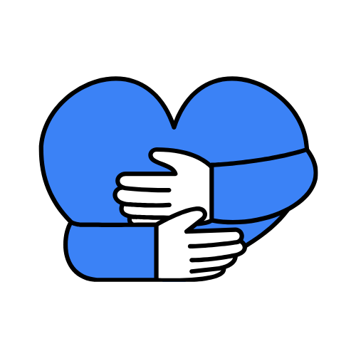

# DermaNow 🌟

**Team Members:**  
👨‍💻 Shawn Chee — *Web3 Engineer*  
🧑‍💻 Yu Han — *Full-stack Developer*  
📊 Eugene See — *Business Analyst / QA*  
🤖 Jin Khye — *AI/ML Engineer*  
🧑‍💻 Melvin Lee — *Full-stack Developer*

**Presentation Slide:**  
🎞️ [View our Google Drive Link](https://drive.google.com/file/d/1glmER9PzY-VC7BEyiFT_V998fyDrLVvm/view?usp=sharing)

## Blockchain-Powered Shariah-Compliant Charity Platform

  

DermaNow is Malaysia's revolutionary charity platform that leverages blockchain technology to create transparent, efficient, and Shariah-compliant donation experiences. We connect donors directly with service providers, eliminating middlemen and ensuring your contributions make the maximum impact.

  

## 🚀 Unique Value Propositions

- **100% Shariah-Compliant** - All projects and financial mechanisms adhere to Islamic principles, including Zakat, Sadaqah, Waqf, and Mudarabah
- **Maximize Barakah** 🌙 - Amplify the spiritual and ethical value of your giving through transparency and sincerity
- **Milestone-Based Funding** - Transparent release of funds based on project progress
- **Direct-to-Provider Payments** - Eliminating middlemen for maximum donation impact
- **Blockchain Transparency** - All transactions are verifiable on the Ethereum blockchain
- **AI-Powered Compliance** - Automated Shariah compliance verification for all projects
- **Ethical DeFi Staking (Mudarabah)** - Generate returns on donations through halal profit-sharing mechanisms

## ✨ Core Features

### 🔄 Transparent Milestone-Based Donations
- Sequential funding of project milestones
- Funds released only after verification by trusted committee (Semi-DAO)
- Real-time progress updates with photo/video proof
- Direct payments to verified service providers

  

### 💼 Shariah-Compliant DeFi Staking (Mudarabah)
- Stake ETH to earn 2–5% annual profit share in a halal manner
- All returns automatically channeled to charity projects
- Aligns with Islamic financial principles for ethical investing
- Donations that generate barakah through sustainable giving

### 🛡️ Rigorous Verification System
- Service provider verification through legal documents and portfolio review
- Charity organization verification before project listing
- Committee oversight for fund disbursement

### 🤖 AI-Powered Chatbot Assistant
- Conversational donation experience
- Direct transactions through chat interface
- Personalized project recommendations

  

### 🏆 Donor Engagement & Rewards
- Level-up system based on donation history
- Exclusive perks for active donors
- Community recognition for impact
- Promote the spirit of giving and attaining barakah

## 🔍 How It Works

1. **Create a Wallet** - Set up a MetaMask wallet to interact with the platform
2. **Deposit Funds** - Use our MoonPay integration to convert fiat to ETH with minimal fees
3. **Browse Projects** - Explore Shariah-compliant charity initiatives
4. **Donate to Milestones** - Contribute to specific project phases
5. **Track Progress** - Receive updates as milestones are completed
6. **Stake for Impact** - Optionally stake ETH (Mudarabah) to generate additional charitable funds

> "We aim to not only maximize impact, but to maximize **barakah** — spiritual blessings that multiply good beyond what meets the eye."

## 💻 Tech Stack

- **Frontend**: Next.js, TailwindCSS
- **Backend**: Supabase, Python
- **Blockchain**: Solidity, Ethereum, MetaMask, Infura, Etherscan
- **AI/ML**: OpenAI, Hugging Face, Python
- **Infrastructure**: Cloudflare, Supabase

# 📄 MIT License

**Copyright (c) 2025 DermaNow**

Permission is hereby granted, free of charge, to any person obtaining a copy  
of this software and associated documentation files (the "Software"), to deal  
in the Software without restriction, including without limitation the rights  
to use, copy, modify, merge, publish, distribute, sublicense, and/or sell  
copies of the Software, and to permit persons to whom the Software is  
furnished to do so, subject to the following conditions:

> The above copyright notice and this permission notice shall  
> be included in all copies or substantial portions of the Software.
